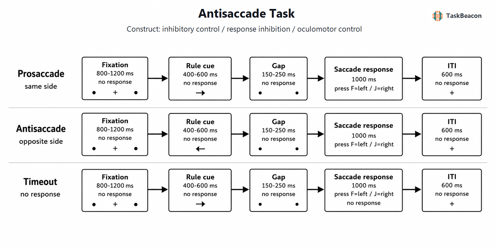

# 反眼跳范式：从反射性定向抑制到目标导向眼动控制的实验测量

突现的外周视觉刺激会迅速募集定向系统并诱发朝向刺激的眼跳。目标导向行为则要求个体依据当前规则抑制这一优势反应，并将动作目标转换到刺激的镜像位置。反眼跳任务（antisaccade task）以这一冲突为核心，通过与前眼跳（prosaccade）条件比较，分离刺激驱动定向、任务目标维持、反应抑制、空间向量转换和自主眼跳生成等过程。该范式具有操作简洁、眼动指标时间分辨率高且可与神经影像和电生理记录结合等优势，但其方向错误率并非“抑制能力”的纯测量：规则编码、工作记忆、注意脱离、速度—准确性权衡及眼动测量质量均可改变结果。因而，反眼跳证据的解释单位应是特定条件、阶段和指标，而非笼统的执行控制标签。

## 1. 范式提出与理论背景

Hallett（1978）最早系统描述由指令定义目标的“anti-saccade”操作：外周光点出现后，参与者须把视线移向等距的相反方向。与朝向光点的普通眼跳相比，反眼跳初始反应潜伏期更长、落点误差更大，并常由后续校正眼跳修正。该结果表明，眼跳系统虽然偏向快速中心化突现刺激，却能够依据抽象规则生成无直接视觉标记的动作目标。此后，额叶损伤患者难以压制朝向线索的反射性眼跳，同时也难以生成目标导向眼跳，进一步把任务表现与额叶对定向反应的控制联系起来（Guitton et al., 1985）。

经典理论将正确反眼跳至少分解为两个必要操作：抑制朝向外周刺激的前眼跳，以及计算并启动方向相反的自主眼跳（Everling & Fischer, 1998）。较快的刺激驱动通路与较慢的目标导向通路形成竞争；任务规则在靶刺激出现前的维持状态、固视系统的活动以及额—顶叶对上丘和基底节眼动回路的调节，共同影响哪一反应先达到启动阈值（Munoz & Everling, 2004）。这一分解解释了方向错误的两种常见形态：错误前眼跳可能直接完成，也可能被迅速察觉并以正确反眼跳校正。仅把二者合并为“不正确试次”会损失有关抑制失败和错误监控的信息。

## 2. 任务逻辑、流程与核心参数

标准反眼跳试次以中央固视开始，随后在左侧或右侧呈现外周靶刺激。前眼跳条件要求首个有效眼跳朝向靶刺激，反眼跳条件要求首个有效眼跳朝向等距镜像位置。条件可以分区组呈现，也可以由中央符号或颜色逐试次提示；混合设计增加规则切换与任务目标重配置要求，因此不能与纯区组设计直接等同。典型因变量包括首眼跳方向错误率、正确反眼跳潜伏期、错误眼跳潜伏期、错误后的校正概率与校正时间，以及眼跳增益或终点误差。眼动仪记录中还应预先规定有效潜伏期范围、眨眼与固视偏离剔除标准，并区分首眼跳和校正眼跳（Antoniades et al., 2013）。

固视—靶刺激的时间关系构成关键方法学操控。固视点与靶刺激同步转换的 step 条件、固视提前消失的 gap 条件以及固视在靶刺激出现后仍保留的 overlap 条件，会改变注意脱离和眼跳启动准备。gap 通常缩短反应潜伏期，也可能提高快速方向错误的比例；保留潜在目标位置标记则会改变反向目标的空间计算和年龄效应（Everling & Fischer, 1998; Edelman et al., 2023）。因此，反眼跳成本（反眼跳相对于前眼跳的潜伏期或错误率差异）同时受固视释放、视觉目标可见性和规则安排影响。

规则线索与靶刺激之间的准备间隔决定参与者能否在靶刺激到达前激活任务目标。工作记忆容量与反眼跳表现的关联部分发生在这一准备阶段；八项实验的结果显示，较高工作记忆容量个体在不同准备延迟下表现出较有效的目标维持，但效应总体较小，反眼跳不能被简化为工作记忆容量的替代指标（Unsworth et al., 2022）。经典范式没有必需的逐试次反馈或自适应阶梯。是否呈现正确性反馈、是否依据个体表现改变靶刺激时限，取决于训练或临床目的；若采用此类程序，需单独报告，因为反馈学习和难度滴定会改变误差率及策略。

## 3. 主要行为与神经科学发现

### 3.1 行为分解与构念解释

反眼跳方向错误率最直接反映优势前眼跳未被成功阻止，但它还依赖规则是否被正确编码和维持。正确反眼跳潜伏期则包含从视觉定位到镜像向量转换、自主反应准备和启动的累积时间。两项指标可以分离：参与者可通过延迟启动降低错误率，也可在错误率相近时表现出不同的反向目标生成速度。错误后校正说明系统已经获得或恢复正确目标表征，不能据此反推初始抑制成功。由此，研究宜同时报告条件别错误率和潜伏期分布，必要时采用竞争累积或潜伏过程模型，而非只比较均值（Munoz & Everling, 2004; Płomecka et al., 2020）。

### 3.2 fMRI 与脑网络证据

fMRI 与 PET 研究较一致地显示，前眼跳和反眼跳共同募集额叶眼区、辅助眼区、顶内沟、丘脑、纹状体及小脑等眼动网络；反眼跳相对于前眼跳表现出更强的额—纹状体—顶叶募集，并额外涉及背外侧和腹外侧前额叶（Jamadar et al., 2013）。这一对比支持反眼跳对任务规则和自主控制提出更高要求，但 BOLD 差异同时包含准备、抑制、向量转换和反应时差异，不能把单一脑区活动视为抑制过程的充分证据。人类病灶、成像和电生理结果的收敛更适合支持分布式控制解释：额—顶叶区域维持规则并形成动作目标，皮质下眼动回路参与候选反应竞争及执行（McDowell et al., 2008）。

### 3.3 EEG/ERP 的时间进程

事件相关电位（event-related potential, ERP）能够区分靶刺激前准备与错误后的监控。带准备间隔的前/反眼跳设计显示，靶刺激前中央负慢波和顶叶慢波随任务规则而变化，源估计提示额顶网络在反眼跳准备中具有较强参与；头皮电位的源定位仍存在逆问题，不能提供与 fMRI 等价的空间证据（Richards, 2013）。错误眼跳发生后，错误相关负波（error-related negativity, ERN）可见于有意识和无意识错误，而较晚的错误正波（error positivity, Pe）对有意识错误更大，支持快速动作监控与错误觉察的时间分离（Endrass et al., 2007）。近年的概率预线索设计进一步发现，高反眼跳概率增大准备期的关联负变（contingent negative variation, CNV），实际规则与预期不一致时 N2 和 P3a 增强；这些结果把主动准备和靶后反应性控制绑定到不同时间窗，但来自小样本的新变式，尚需独立重复（Duschek et al., 2025）。

## 4. 范式发展与主要应用

发展研究利用反眼跳同时具有高时间精度和明确错误定义的特点，描绘自主控制的成熟轨迹。9—26 岁纵向 fMRI 数据显示，反眼跳行为持续改善，而运动反应、执行控制和错误加工区域具有不同的发展曲线；校正错误时背侧前扣带活动持续增强并与较低错误率相关（Ordaz et al., 2013）。覆盖 5—93 岁的 604 人横断样本则表明，前/反眼跳的潜伏期和错误指标随年龄呈非线性变化，儿童期至成年早期改善与老年期下降需要分别建模（Yep et al., 2022）。年龄效应还受目标位置是否保留视觉标记影响，说明“发展性抑制变化”可能夹带空间目标生成难度（Edelman et al., 2023）。

临床研究最稳定的应用是比较精神和神经系统疾病群体的方向错误率与潜伏期。跨精神障碍元分析发现，多数诊断群体的反眼跳错误率升高，其中精神分裂症效应最大，潜伏期效应较小且异质性更高（Breuer et al., 2024）。这一跨诊断分布支持把反眼跳视为与抑制控制相关的实验表型，而非疾病特异性标志物。药物、症状严重度、一般认知、视力和眼动功能均可能造成组间差异；群体平均效应不应直接用于个体诊断或病因推断（Hutton & Ettinger, 2006）。

## 5. 测量效度与解释边界

反眼跳具有清晰的表面效度和实验效度：同一外周刺激下改变规则，即可比较优势定向与目标导向反应。然而，反眼跳减前眼跳的差值并不自动消除一般加工速度、视觉检测和运动执行差异。混合或区组呈现、线索颜色、gap/overlap、靶刺激偏心度、练习量、错误反馈以及剔除阈值都会改变成本。跨研究合并前，应确认首眼跳定义、错误校正处理和有效试次数是否一致；国际标准化协议的价值正在于保留潜伏期分布、方向错误和幅度信息，并统一采集与报告要素（Antoniades et al., 2013）。

眼跳潜伏期和方向错误的重测信度可达到中等或较好水平，但不同指标、时间间隔、年龄群体和试次数之间差异明显。早期研究报告多项眼跳测量在较长间隔下仅具中等稳定性；近期一周重测研究在老年组的多项反眼跳指标获得良好至优秀的组内相关，但空间精度等指标并非同样稳定（Klein & Fischer, 2005; Płomecka et al., 2020）。稳健的条件均值或群体差异不保证可靠的个体排序。作为个体差异、纵向变化或临床筛查指标时，应进行样本内信度估计、增加有效试次，并避免把低基线错误率产生的地板效应解释为控制能力上限。

效度判断还应区分率指标与时间指标的统计性质。方向错误率受二项分布和试次数约束，接近 0 或 1 时，均值差和相关系数均可能失真；正确潜伏期则只来自成功试次，错误率较高的参与者会留下经过选择的反应时样本。将超时、方向错误和已校正错误合并会进一步掩盖不同失败过程。预注册分析宜分别建立试次水平的正确性模型和潜伏期模型，报告各条件有效试次数及速度—准确性关系。若目标是测量潜在的控制特质，多任务潜变量通常比单一反眼跳分数更能限制任务特异方差；现有工作记忆关联和临床组差异均不足以证明该任务具有单一构念结构（Hutton & Ettinger, 2006; Unsworth et al., 2022）。

## 6. TaskBeacon 中的任务实现

### 6.1 任务资源与访问入口

| 资源 | ID | 用途 | 地址 |
|---|---|---|---|
| 完整实验源仓库 | T000032 | PsychoPy/PsyFlow 行为型键盘实现 | [GitHub](https://github.com/TaskBeacon/T000032-antisaccade) |
| 配对网页源仓库 | H000032 | 配对网页实现源代码；现有 T 仓库未说明其采集类型与成熟度 | [GitHub](https://github.com/TaskBeacon/H000032-antisaccade) |

当前公开入口未提供经核验的直接浏览器运行页，因此不能把 H000032 表述为完整实验的在线等价版本。T000032 的采集类型标注为行为，采用键盘方向键代理视线方向；它测量规则条件下的左右选择、正确率与按键反应时，不直接记录眼跳潜伏期、首眼跳方向、增益或校正眼跳。与标准眼动版比较时，这一差异改变了构念范围：所得反眼跳成本更接近空间反应规则转换和手动选择控制，不能直接解释为眼动抑制参数。

### 6.2 实现流程与关键参数

*图 1. TaskBeacon 当前版本的试次流程。每个试次依次经历中央固视（0.8–1.2 s）、规则线索（0.4–0.6 s）、无规则文字的 gap（0.15–0.25 s）、外周靶刺激与反应窗口（最长 1.0 s），以及中央固视形式的试次间隔（0.6 s）。绿色“朝圆点”对应前眼跳规则，要求按与靶刺激同侧的方向键；红色“背离圆点”对应反眼跳规则，要求按靶刺激对侧的方向键。F 表示左，J 表示右。正确键按规则和靶侧确定，未在时限内按键计为超时；试次内不呈现正确/错误反馈，区组和任务结束时汇总正确率、正确反应平均时及超时数。靶侧由固定种子和试次编号确定，不依据表现自适应调整。*

当前版本包含 3 个区组，每区组 48 个试次，共 144 个试次。条件流包含前眼跳和反眼跳两类规则，左右靶位置按确定性伪随机程序生成。记录字段包括规则、靶侧、正确键、实际反应、正确性、反应时和超时状态。固定种子提高不同参与者条件安排的一致性，但也意味着刺激序列并非按个体表现变化。该实现没有逐试次反馈、奖励或自适应控制器；因此，主要分析应报告两规则条件的正确率和正确反应时，并把超时与错误方向反应分开。若研究问题要求经典眼跳抑制指标，应将外周刺激几何参数改用视角单位并接入眼动记录，预先定义首眼跳和校正眼跳规则，而不宜以 F/J 按键结果替代。

## 参考文献

Antoniades, C., Ettinger, U., Gaymard, B., Gilchrist, I., Kristjánsson, A., Kennard, C., Leigh, R. J., Noorani, I., Pouget, P., Smyrnis, N., Tarnowski, A., Zee, D. S., & Carpenter, R. H. S. (2013). An internationally standardised antisaccade protocol. *Vision Research, 84*, 1–5. https://doi.org/10.1016/j.visres.2013.02.007

Breuer, F., Meyhöfer, I., Lencer, R., Sprenger, A., Roesmann, K., Schag, K., Dannlowski, U., & Leehr, E. J. (2024). Aberrant inhibitory control as a transdiagnostic dimension of mental disorders—A meta-analysis of the antisaccade task in different psychiatric populations. *Neuroscience & Biobehavioral Reviews, 165*, 105840. https://doi.org/10.1016/j.neubiorev.2024.105840

Duschek, S., Piwkowski, P., Rainer, T., Vorwerk, J., Riml, L., & Ettinger, U. (2025). Neural correlates of proactive and reactive control investigated using a novel precued antisaccade paradigm. *Psychophysiology, 62*(2), e70015. https://doi.org/10.1111/psyp.70015

Edelman, J. A., Ahles, T. A., Prashad, N., Fernbach, M., Li, Y., Melara, R. D., & Root, J. C. (2023). The effect of visual target presence and age on antisaccade performance. *Journal of Neurophysiology, 129*(2), 307–319. https://doi.org/10.1152/jn.00186.2022

Endrass, T., Reuter, B., & Kathmann, N. (2007). ERP correlates of conscious error recognition: Aware and unaware errors in an antisaccade task. *European Journal of Neuroscience, 26*(6), 1714–1720. https://doi.org/10.1111/j.1460-9568.2007.05785.x

Everling, S., & Fischer, B. (1998). The antisaccade: A review of basic research and clinical studies. *Neuropsychologia, 36*(9), 885–899. https://doi.org/10.1016/S0028-3932(98)00020-7

Guitton, D., Buchtel, H. A., & Douglas, R. M. (1985). Frontal lobe lesions in man cause difficulties in suppressing reflexive glances and in generating goal-directed saccades. *Experimental Brain Research, 58*(3), 455–472. https://doi.org/10.1007/BF00235863

Hallett, P. E. (1978). Primary and secondary saccades to goals defined by instructions. *Vision Research, 18*(10), 1279–1296. https://doi.org/10.1016/0042-6989(78)90218-3

Hutton, S. B., & Ettinger, U. (2006). The antisaccade task as a research tool in psychopathology: A critical review. *Psychophysiology, 43*(3), 302–313. https://doi.org/10.1111/j.1469-8986.2006.00403.x

Jamadar, S. D., Fielding, J., & Egan, G. F. (2013). Quantitative meta-analysis of fMRI and PET studies reveals consistent activation in fronto-striatal-parietal regions and cerebellum during antisaccades and prosaccades. *Frontiers in Psychology, 4*, 749. https://doi.org/10.3389/fpsyg.2013.00749

Klein, C., & Fischer, B. (2005). Instrumental and test–retest reliability of saccadic measures. *Biological Psychology, 68*(3), 201–213. https://doi.org/10.1016/j.biopsycho.2004.06.005

McDowell, J. E., Dyckman, K. A., Austin, B. P., & Clementz, B. A. (2008). Neurophysiology and neuroanatomy of reflexive and volitional saccades: Evidence from studies of humans. *Brain and Cognition, 68*(3), 255–270. https://doi.org/10.1016/j.bandc.2008.08.016

Munoz, D. P., & Everling, S. (2004). Look away: The anti-saccade task and the voluntary control of eye movement. *Nature Reviews Neuroscience, 5*(3), 218–228. https://doi.org/10.1038/nrn1345

Ordaz, S. J., Foran, W., Velanova, K., & Luna, B. (2013). Longitudinal growth curves of brain function underlying inhibitory control through adolescence. *Journal of Neuroscience, 33*(46), 18109–18124. https://doi.org/10.1523/JNEUROSCI.1741-13.2013

Płomecka, M. B., Barańczuk-Turska, Z., Pfeiffer, C., & Langer, N. (2020). Aging effects and test–retest reliability of inhibitory control for saccadic eye movements. *eNeuro, 7*(5), ENEURO.0459-19.2020. https://doi.org/10.1523/ENEURO.0459-19.2020

Richards, J. E. (2013). Cortical sources of ERP in prosaccade and antisaccade eye movements using realistic source models. *Frontiers in Systems Neuroscience, 7*, 27. https://doi.org/10.3389/fnsys.2013.00027

Unsworth, N., Robison, M. K., & Miller, A. L. (2022). On the relation between working memory capacity and the antisaccade task. *Journal of Experimental Psychology: Learning, Memory, and Cognition, 48*(10), 1420–1447. https://doi.org/10.1037/xlm0001060

Yep, R., Smorenburg, M. L., Riek, H. C., Calancie, O. G., Kirkpatrick, R. H., Perkins, J. E., Huang, J., Coe, B. C., Brien, D. C., & Munoz, D. P. (2022). Interleaved pro/anti-saccade behavior across the lifespan. *Frontiers in Aging Neuroscience, 14*, 842549. https://doi.org/10.3389/fnagi.2022.842549
